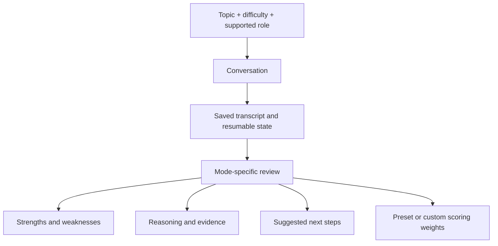
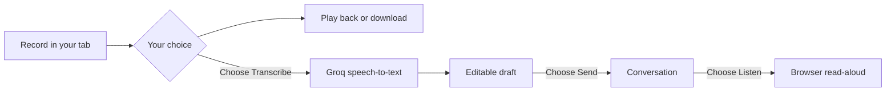

[ArguLab](README.md) / **The practice atlas** · [History](PROJECT_HISTORY.md) · [Data and accessibility](docs/PRIVACY_AND_ACCESSIBILITY.md)

# Find the conversation you want to practice.

**PRODUCT GUIDE · v3.0.1**

## Make your case

| Room                | Your role               | What you work through                                                                                 |
| :------------------ | :---------------------- | :---------------------------------------------------------------------------------------------------- |
| **Debate Arena**    | Defend a position       | Present an argument, respond to Socratic challenges, clarify your position and review the discussion. |
| **Negotiation**     | Work with a counterpart | Navigate a scenario, priorities, concessions and trade-offs.                                          |
| **Case Discussion** | Make a recommendation   | Frame a problem, reason through evidence and explain your proposed decision.                          |

## Find your voice

| Room                    | Your role             | What you work through                                                                            |
| :---------------------- | :-------------------- | :----------------------------------------------------------------------------------------------- |
| **Interview Simulator** | Answer as a candidate | Choose a format, describe your background or target role, then respond to contextual follow-ups. |
| **Public Speaking**     | Structure a speech    | Work on a topic and review the submitted content, organization and reasoning.                    |
| **Extempore**           | Think on your feet    | Receive a generated topic, prepare, then work through a timed response.                          |

## Read the room

| Room                      | Your role                | What you work through                                                                  |
| :------------------------ | :----------------------- | :------------------------------------------------------------------------------------- |
| **Group Discussion**      | Join the conversation    | Contribute to a simulated room with an AI moderator and distinct participants.         |
| **Real-World Simulation** | Take a scenario role     | Respond to simulated stakeholders, context and events.                                 |
| **Observer Mode**         | Analyze the conversation | Read a generated discussion, answer analysis questions and review your interpretation. |

> [!NOTE]
> Participants are AI-generated. These modes do not connect you to live human practice partners.

## A session is more than a chat

**15 review dimensions** support preset profiles and custom weights. Re-scoring changes how a review is weighted; it does not award a second completion. Thinking View provides structured argument analysis where supported, rather than access to hidden model reasoning.

Response preferences support **English**, **Hindi** and **mixed language**. AI output may be inaccurate, suggested evidence is not independently fact-checked, and scores do not predict examination, admission or employment outcomes.

## Audio with a clear handoff

Recording alone uploads nothing. Transcription sends audio through the backend only after your explicit action. Review and edit the returned text before sending it. Read-aloud uses the browser or operating system; some voices may process text remotely.

| On your device                                 | At the transcription boundary                                         | When audio is unavailable                            |
| :--------------------------------------------- | :-------------------------------------------------------------------- | :--------------------------------------------------- |
| Record, pause, resume, play back and download. | Separate quotas, a two-minute recorder limit and a 4 MB upload limit. | Continue with written input; browser support varies. |

<strong>Model defaults and request budgets</strong>

| Capability              | Default provider/model        | Application limits                                                            |
| :---------------------- | :---------------------------- | :---------------------------------------------------------------------------- |
| Conversation and review | Groq `openai/gpt-oss-120b`    | 60 per visitor/hour; 600 across the app/hour.                                 |
| Transcription           | Groq `whisper-large-v3-turbo` | 10 per visitor/hour; 20 per visitor/day; 100 globally/day; 5 globally/minute. |
| Read-aloud              | Browser speech synthesis      | No Groq request; voice support depends on the device.                         |

These are configured defaults, not a promise of provider availability or unlimited free capacity. Provider quotas also apply. A separate API key does not necessarily provide a separate provider quota.

## Build a practice record

| Resume                                                   | Notice patterns                                                              | Choose visibility                                                  |
| :------------------------------------------------------- | :--------------------------------------------------------------------------- | :----------------------------------------------------------------- |
| Return to unfinished sessions and completed transcripts. | See saved activity, calendar streaks, levels, achievements and skill trends. | Opt into the leaderboard with a display name and aggregate totals. |

Guest history stays in the current browser. Account history can be retrieved after signing in on another device. Guest sessions are not automatically merged into an account. Public leaderboard entries exclude private transcripts and email addresses.

**Demonstration content:** a separate dataset contains **18 fictional sessions across nine modes**. These illustrate workflows and reviews; they are not customer testimonials. Demo credentials are not published here.

## Take your work with you

| Output                   | Use it for                                     |
| :----------------------- | :--------------------------------------------- |
| **Text report**          | A readable record of selected session content. |
| **Print / save as PDF**  | A report to keep or share.                     |
| **JSON export**          | A copy of practice or account data.            |
| **Local audio download** | Your recording, saved from the current tab.    |

**Settings → Your data** also provides history clearing and permanent account deletion. Email accounts require the current password; Google-only accounts require a recent sign-in when that provider is enabled. Active records and sessions are removed; exports, other-device copies and provider backups/logs have separate retention.

## Make the interface fit

| Appearance                                  | Interaction                                                                 | Alternatives                                               |
| :------------------------------------------ | :-------------------------------------------------------------------------- | :--------------------------------------------------------- |
| Light, dark and system themes; larger text. | Keyboard navigation, visible focus, labelled inputs and responsive dialogs. | Reduced motion and written input alongside optional audio. |

The v3.0.1 release includes automated checks in both themes and small-screen consent/deletion checks. This does not establish complete WCAG conformance.

<strong>Current release boundaries</strong>

- Adults only, using self-declaration rather than identity verification; no children's accounts or parental-consent flow.
- Google OAuth and recovery email need their live provider setup completed.
- No payments, subscriptions, advertisements, marketing email list or analytics-tracking SDK.
- No real-time human multiplayer, identity-verified competition, vocal-delivery grading or guaranteed AI accuracy.

---

[Open a practice room ↗](https://argulab.netlify.app/train) · [Back to the product guide](README.md) · [See how the app evolved](PROJECT_HISTORY.md)
