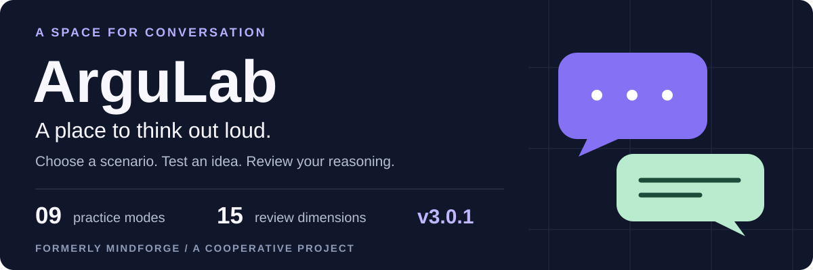
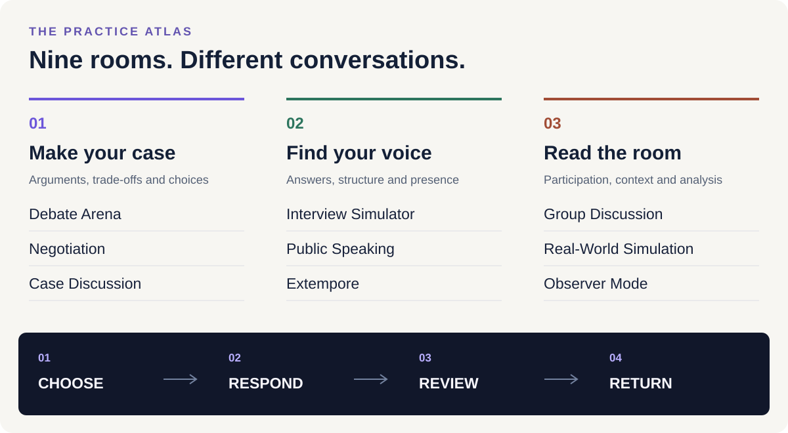
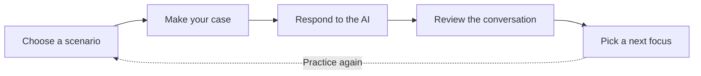
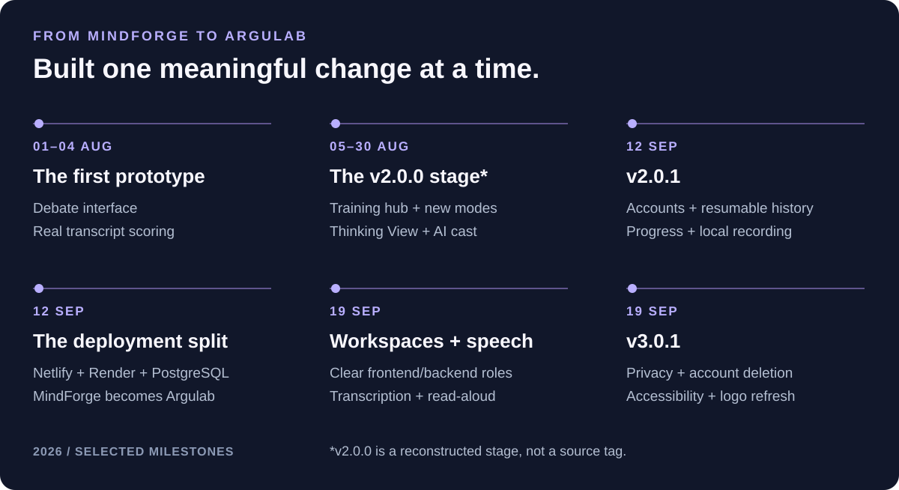
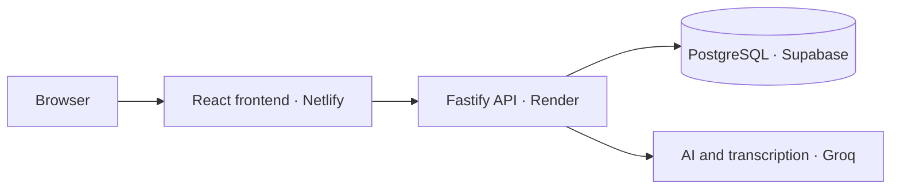

  

  <a href="https://argulab.netlify.app"><strong>Open the app ↗</strong></a> ·
  <a href="FEATURES.md">Explore the practice atlas</a> ·
  <a href="PROJECT_HISTORY.md">Follow the project story</a>

# Practice the conversation before it matters.

A difficult question. An unfamiliar room. An idea worth defending. **ArguLab** gives you a place to rehearse those moments with AI-generated conversations and feedback.

Choose a scenario, work through a conversation, then revisit how you framed your argument. Start as a guest or keep a practice history with an email account. ArguLab is a cooperative project, formerly **MindForge**.

| For the next conversation                                                  | For the next attempt                                                                | For your own records                                                              |
| :------------------------------------------------------------------------- | :---------------------------------------------------------------------------------- | :-------------------------------------------------------------------------------- |
| **Practice** Debate, interview, negotiate or speak to a simulated room. | **Reflect** Explore claims, evidence, counterarguments and suggested next steps. | **Keep control** Resume sessions, export reports and manage your account data. |

## 01 / Find your room

| Make your case                                             | Find your voice                                                  | Read the room                                                         |
| :--------------------------------------------------------- | :--------------------------------------------------------------- | :-------------------------------------------------------------------- |
| [Debate · Negotiation · Cases](FEATURES.md#make-your-case) | [Interviews · Speaking · Extempore](FEATURES.md#find-your-voice) | [Group discussion · Simulation · Observer](FEATURES.md#read-the-room) |

**Your setup:** choose a topic, difficulty and supported role or format. Response preferences include English, Hindi and a mix of both. These are AI simulations, not rooms with live human participants.

## 02 / From an idea to the next attempt

**What stays with you:** the transcript, mode-specific feedback, saved reviews and practice history. Adjust scoring weights to explore a review without awarding another completion.

> [!NOTE]
> AI reviews are coaching estimates. They do not certify ability, verify every claim or guarantee an outcome.

## 03 / Speak when it helps. Type when it suits you.

| Record                                                                                     | Transcribe                                                                     | Listen                                                                   |
| :----------------------------------------------------------------------------------------- | :----------------------------------------------------------------------------- | :----------------------------------------------------------------------- |
| Pause, resume, play back or download a short recording. Recording alone stays in your tab. | Choose **Transcribe**, review the editable draft, then send the text yourself. | Choose **Listen** to hear a reply through your browser's speech service. |

[See the audio journey and limits →](FEATURES.md#audio-with-a-clear-handoff)

## 04 / Your practice, your choices

| Start lightly                                               | Continue across visits                                                                  | Decide what remains                                                                   |
| :---------------------------------------------------------- | :-------------------------------------------------------------------------------------- | :------------------------------------------------------------------------------------ |
| **Guest practice** History stays in the current browser. | **Email account** Retrieve saved account history after signing in on another device. | **Settings → Your data** Export, clear history or permanently delete your account. |

Guest history is not automatically merged into an account. Leaderboard membership is optional. The app uses essential storage and has no advertising or marketing analytics SDKs in this release.

[Privacy and accessibility guide →](docs/PRIVACY_AND_ACCESSIBILITY.md)

## 05 / The project behind the practice

[Read the selected milestones and their source commits →](PROJECT_HISTORY.md)

### What runs where

<strong>Current availability and boundaries</strong>

| Available now                                                                             | Setup still required                                                                 | Outside this release                                                        |
| :---------------------------------------------------------------------------------------- | :----------------------------------------------------------------------------------- | :-------------------------------------------------------------------------- |
| Guest practice, email/password accounts, nine modes, reviews, exports and optional audio. | Google sign-in and password-recovery email need their live provider setup completed. | Real-time human multiplayer, vocal-delivery grading and paid subscriptions. |

The app is free, with no checkout or automatic charges. Application and provider quotas apply. Free hosting can sleep or pause, so the first request may take time to connect. AI practice is for adults aged 18 or older and requires acknowledgement of the terms.

Speech reviews assess submitted text, not pronunciation or vocal delivery. Browser voices may process text remotely. Provider availability and configured limits can change.

---

### Keep exploring

| Product guide                         | Development story                     | Trust and controls                                             |
| :------------------------------------ | :------------------------------------ | :------------------------------------------------------------- |
| [Features and workflows](FEATURES.md) | [Project history](PROJECT_HISTORY.md) | [Privacy and accessibility](docs/PRIVACY_AND_ACCESSIBILITY.md) |

**This repository is the public product guide.** It contains documentation, explanatory graphics and the supplied logo. Application source, prompts, tests, deployment configuration and credentials are maintained separately in a private repository.

[Privacy](https://argulab.netlify.app/privacy) · [Terms](https://argulab.netlify.app/terms) · [Cookies](https://argulab.netlify.app/cookies) · [Refunds](https://argulab.netlify.app/refunds) · [Licenses](https://argulab.netlify.app/licenses) · [Publication notice](NOTICE.md)
