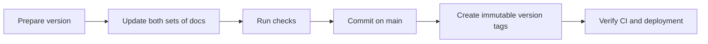

# Maintaining ArguLab releases

**Release: v3.0.2**

The source repository's root **`VERSION`** is the version authority. All four package manifests and the generated `shared/app-version.ts` must match it. The public repository carries a matching `VERSION`, release notes, AI guide and changelog.



## Version rules

| Change                                              | Increment | Example       |
| --------------------------------------------------- | --------- | ------------- |
| Compatible fix, cleanup or documentation correction | Patch     | 3.0.2 → 3.0.3 |
| New compatible feature                              | Minor     | 3.0.2 → 3.1.0 |
| Deliberately incompatible API/data contract         | Major     | 3.0.2 → 4.0.0 |

Use `v3.0.2` for a Git tag, release title and release commit message; use `3.0.2` in `VERSION` and package manifests. A commit message is a label, while the tag identifies the exact released snapshot. Later work can change a file's latest-commit label without changing the contents of an older tag.

## Recorded versions

| Version | Source reference                | How to interpret it                                                    |
| ------- | ------------------------------- | ---------------------------------------------------------------------- |
| v1.0.0  | `2023593`                       | Retrospective milestone tag for the initial debate/scoring stage       |
| v2.0.0  | `fedb5c5`                       | Retrospective milestone tag for the expanded platform snapshot         |
| v2.0.1  | `1e7ebb4`                       | Retrospective tag on the commit already titled “MindForge v 2.0.1”     |
| v3.0.1  | `48c68ef`                       | Existing annotated release tag, preserved unchanged                    |
| v3.0.2  | `v3.0.2` tag in each repository | Current release, including API routing cleanup and version maintenance |

The first two version names follow the project's stated release history. Their snapshot selection is reconstructed from significant commits; the new tag annotations explicitly record that they were added retrospectively on 26 September 2026. Original commits and dates are unchanged. There is no invented v3.0.0 tag.

The public repository began after the older application stages. Its v3.0.2 tag identifies public documentation only; old source snapshots are described here instead of copying private code or fabricating public source history.

## Prepare the next version

In the **source repository**, from its root:

```sh
bun run release:prepare 3.0.3
```

Use the actual next version. This updates `VERSION`, package versions, the generated runtime version, current-guide version banners and the cover badge, and creates draft release notes/changelog text. It neither commits nor pushes. Replace the draft text with the changes actually shipped, review all current-version wording and update the milestone graphic when the release merits it.

Update the **public repository** with the same `VERSION`, `CHANGELOG.md`, `VERSIONING.md`, `PROJECT_HISTORY.md`, `docs/ai/README.md`, current release notes and reviewed graphics. Update its main README, feature guide, privacy overview and publication notice as appropriate. Keep its documentation allowlist in `.gitignore`; never copy implementation files, environment files, credentials, tests or the source `.git` directory.

Run these from the source repository:

```sh
bun run release:check
bun run release:check --showcase D:/Projects/ArguLab
bun run check
bun run test:e2e
bun run test:persistence
bun run test:import
```

`release:check` verifies the current version across manifests, the runtime constant, guide banners, release notes and changelog. `--showcase` also checks the public version and matching shared release documents. CI runs the source check on every push. Provider configuration changes require checking the AI guide too.

## Publish a reviewed release

Commit relevant changes in **each** repository on `main`, using the release version as the commit message. Create an annotated tag at that repository's release commit, then push the branch and that specific tag:

```sh
git commit -m "v3.0.3"
git tag -a v3.0.3 -m "ArguLab v3.0.3"
git push origin main
git push origin v3.0.3
```

Stage and review the intended files before committing. These example commands are for the next release, not for recreating v3.0.2. Do not move an existing tag, amend published commits or force-push history. Fix a published release with another patch version.

Verify GitHub CI, the live frontend and backend, and the `version` field from `/api/health`. Netlify and Render continue deploying from the private repository's `main`; tagging alone does not change the configured deployment source. App release numbers are separate from policy-consent versions and authentication token scopes, which change only when their behavior requires it.

[Current changes](CHANGELOG.md) · [Project story](PROJECT_HISTORY.md) · [AI task guide](docs/ai/README.md)
