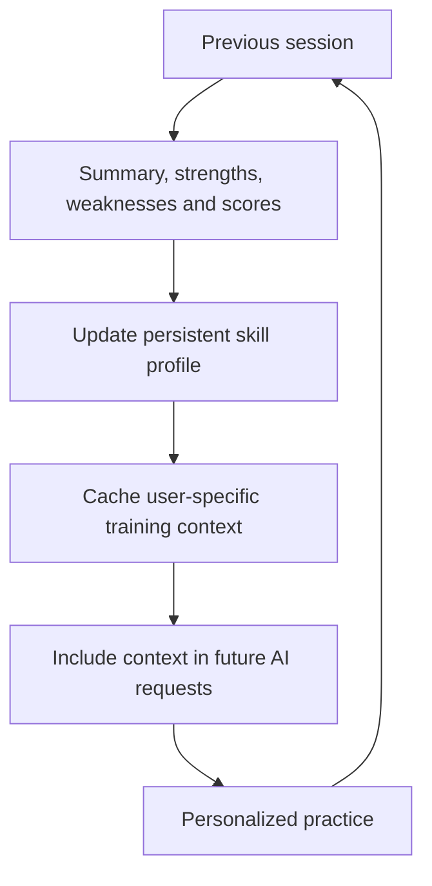
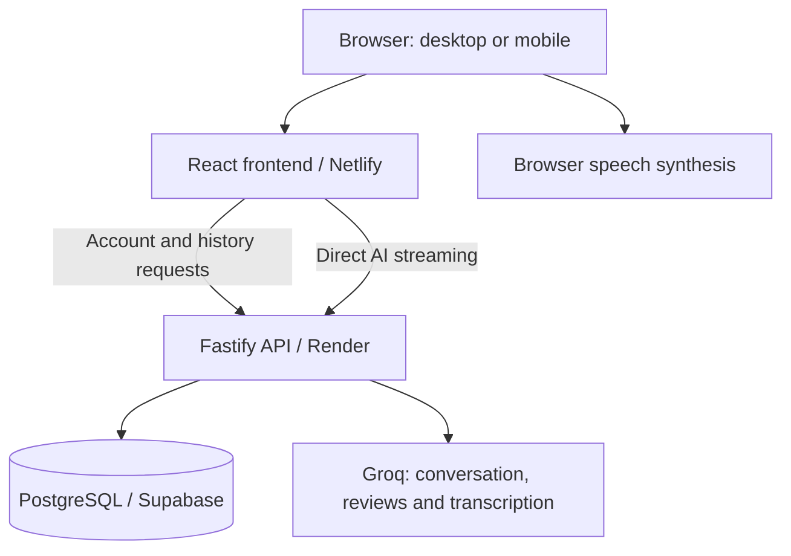

# ArguLab — engineering guide

**AI communication practice & personalized training** 
[Live dashboard](https://argulab.netlify.app/dashboard) · [Product guide](../README.md) · [Nine practice modes](../FEATURES.md) · [Release evidence](releases/3.0.2.md)

ArguLab combines AI practice, structured evaluation, persistent history and deployed application infrastructure. The engineering work is AI application integration and software delivery: the project does not train or fine-tune the underlying Groq-hosted foundation models.

This repository is the **public documentation companion**. Application source, tests and deployment configuration remain private; see the [publication notice](../NOTICE.md).

## Nine practice modes

| Mode | Practice |
| --- | --- |
| Debate | Build an argument and respond to challenges |
| Group Discussion | Contribute within an AI-moderated group |
| Interview | Answer contextual questions and follow-ups |
| Public Speaking | Structure and rehearse a speech |
| Extempore | Organize a response to an unfamiliar topic |
| Negotiation | Explore interests, trade-offs and agreement |
| Case Discussion | Analyze a case and defend a recommendation |
| Real-World Simulation | Respond to a simulated scenario and stakeholders |
| Observer Analysis | Examine a discussion and evaluate its reasoning |

These are AI simulations. Reviews cover strengths, weaknesses, weak claims, evidence, logical fallacies, counterarguments, improvement suggestions and next steps. The interface supports responsive/mobile web use.

## Personalized training engine

ArguLab's personalization architecture carries performance forward: a completed session produces a summary, strengths/weaknesses and skill scores; persistent user context then shapes future AI training.

This is application-level memory and orchestration, not model fine-tuning. A separate public [MindForge implementation](https://github.com/Laabh-Gupta/MindForge) exposes the [evaluation route](https://github.com/Laabh-Gupta/MindForge/blob/main/backend/app/routers/evaluations.py), [personalization service](https://github.com/Laabh-Gupta/MindForge/blob/main/backend/app/services/personalization.py) and [session route](https://github.com/Laabh-Gupta/MindForge/blob/main/backend/app/routers/sessions.py) behind the richer context flow.

**Release status:** the maintainer reports the richer context workflow is rolling into the ArguLab deployment. The inspected v3.0.2 chat path uses saved performance to select adaptive difficulty, together with the current transcript, mode, topic, role and preferences; full context forwarding in that deployment has not been independently verified. Saved reviews, progress and resumable history are already documented in the current release.

## AI architecture

| Task | Integration |
| --- | --- |
| Conversation and structured AI workflows | Groq; default `openai/gpt-oss-120b` |
| Speech transcription | Groq; default `whisper-large-v3-turbo` |
| Speech output | Browser `speechSynthesis` |

Conversation replies stream to the interface. Structured reviews use validated response schemas. Model defaults are configurable; simulated interviewers and participants are roles within requests, not independently trained models.

Audio follows **record → explicitly transcribe → edit the transcript → submit**. Read-aloud is optional. Evaluation concerns submitted text, not pronunciation or vocal delivery. See the detailed [AI task guide](ai/README.md).

## Application architecture & deployment

| Layer | Technology and responsibility |
| --- | --- |
| Frontend | React 19, TypeScript, Vite, TanStack Router and Tailwind CSS |
| Backend | Fastify, TypeScript, Better Auth and AI SDK |
| Data | Supabase-hosted PostgreSQL; backend-managed access and record ownership |
| Delivery | Netlify frontend, Render backend, backend Docker configuration and GitHub Actions CI |
| Source organization | Separate frontend/backend workspaces and shared TypeScript contracts |

Authentication and account history use a same-origin API proxy; streaming uses a direct backend path. Better Auth manages accounts; Supabase supplies PostgreSQL. Server-side credentials stay outside the browser bundle.

## Engineering controls

Authenticated account APIs, owner-scoped records, database access controls, rate limits, environment configuration and separate deployment responsibilities support the application. Guests retain browser-local history; signed-in users can retrieve persisted history. Reports, JSON export, resumable sessions and account-data controls make the data lifecycle visible.

These are specific implemented controls, not a claim of enterprise certification or unlimited production scale. AI reviews remain coaching estimates.

## Testing & release evidence

| Recorded release | Verification |
| --- | --- |
| v3.0.1 | 47 unit/integration tests + 21 Playwright browser tests |
| v3.0.2 | 58 backend/integration tests + 21 browser tests + four release-tool tests |

The [project history](../PROJECT_HISTORY.md) records the v3.0.1 results. The [v3.0.2 release notes](releases/3.0.2.md) describe type/build checks, persistence/import verification and release validation. These are historical release results, not a fresh test run or coverage percentage for this documentation repository.

## Try the application

1. Open the [live dashboard](https://argulab.netlify.app/dashboard).
2. Start guest practice, or use an email/password account for account history.
3. Choose a mode, complete a session and inspect the review/history/export workflows.

Free hosting can sleep or pause, and AI/provider quotas apply. The live application is the demo; this documentation repository has no application package to install. Existing [product diagrams](assets/) explain the workflows without implying that illustrations are screenshots.

## Configuration & project structure

Only configuration names are described here. Examples include backend `DATABASE_URL`, `AUTH_SECRET`, `SESSION_SECRET`, `GROQ_API_KEY` and model overrides; the frontend uses a public backend-origin setting. Values, credentials, private deployment URLs and application source are intentionally excluded.

Public files:

- [README](../README.md): product overview and entry points.
- [FEATURES](../FEATURES.md): mode and workflow detail.
- [PROJECT_HISTORY](../PROJECT_HISTORY.md): selected development milestones.
- [AI guide](ai/README.md): task-to-model responsibilities.
- [Release notes](releases/3.0.2.md): versioned changes and verification.
- [Privacy/accessibility guide](PRIVACY_AND_ACCESSIBILITY.md): user controls and boundaries.

## Current limits & roadmap

Google sign-in and password-recovery email still require live provider configuration. Human multiplayer, vocal-delivery grading and paid subscriptions are outside the documented release. No delivery dates or additional roadmap commitments are announced here; [release notes](../CHANGELOG.md) are the record of shipped work.
