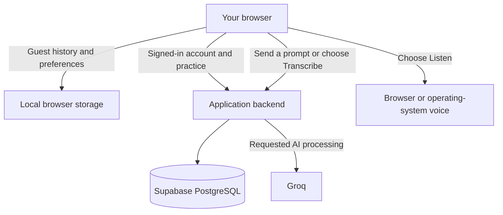

[ArguLab](../README.md) / **Data, choices and accessibility** · [Features](../FEATURES.md)

# Privacy, accessibility and providers

Product overview for **ArguLab v3.0.1**, 19 September 2026. The deployed [Privacy Policy](https://argulab.netlify.app/privacy) and [Terms](https://argulab.netlify.app/terms) describe current use of the app.

## Follow the data

| Your choice              | What changes                                       | What stays separate                                    |
| :----------------------- | :------------------------------------------------- | :----------------------------------------------------- |
| **Use a guest session**  | Practice remains in this browser.                  | It is not automatically merged into an account.        |
| **Choose Transcribe**    | Audio is sent for speech-to-text conversion.       | Recording alone stays in the tab.                      |
| **Join the leaderboard** | A display name and aggregate totals become public. | Email and transcripts stay out of the listing.         |
| **Delete your account**  | Active app records and sessions are removed.       | Downloads, other-device copies and provider retention. |

## User controls

- Age and terms acknowledgements are separate, unchecked choices. The app is for adults aged 18 or older; it does not collect a birth date or identity document for verification.
- Guest history stays in the browser. Signed-in users can export their account/practice data, clear history and permanently delete their account from Settings.
- Account deletion removes active records and revokes sessions. Downloads, device caches and provider backups/logs have separate retention.
- Leaderboard membership is optional. Published totals do not include email addresses or private transcripts.
- Recording stays in the tab unless the user chooses Transcribe. The app does not store uploaded audio files in its database or on server disk.
- The essential-storage notice does not offer an unnecessary “accept all” choice. This release has no advertising, marketing analytics or session-replay SDK.

## The services behind a request

The table identifies each service by its purpose. Optional identity and email integrations are explicitly marked.

| Provider or component                                 | Purpose                                                                                |
| ----------------------------------------------------- | -------------------------------------------------------------------------------------- |
| Netlify                                               | Frontend delivery and account-request proxying.                                        |
| Render                                                | API hosting and requested server processing.                                           |
| Supabase PostgreSQL                                   | Stored accounts, practice history and application security counters.                   |
| Better Auth                                           | Authentication library running in the backend, not a separate hosted identity service. |
| Groq                                                  | AI conversations/reviews and explicitly requested transcription.                       |
| Browser/operating-system speech                       | Optional read-aloud; some voices may process reply text remotely.                      |
| Google OAuth                                          | Optional sign-in integration; live setup remains pending.                              |
| Resend                                                | Requested account email when a sender/provider is configured; no marketing list.       |
| React, TanStack, Radix, Tailwind, Recharts and Lucide | Interface libraries and icons bundled with the app.                                    |
| DM Sans and Space Grotesk                             | Fonts hosted with the app, with license notices.                                       |

Hosting providers receive connection metadata. Provider processing may occur outside the user's country, and account deletion does not promise immediate removal from every provider backup or log. Read the app's policy before submitting personal information, and avoid including sensitive information in practice prompts.

## Designed for different ways of using the app

| See it clearly                                        | Move through it                                                               | Choose your input                                           |
| :---------------------------------------------------- | :---------------------------------------------------------------------------- | :---------------------------------------------------------- |
| Light/dark themes, larger text and readable contrast. | Keyboard navigation, visible focus, labelled controls and responsive dialogs. | Written answers, optional recording and browser read-aloud. |

## Accessibility and accurate claims

The interface supports keyboard navigation, visible focus, labelled controls, light/dark themes, larger text, reduced motion and text alternatives to audio input. The release includes automated checks in both themes and mobile consent/deletion checks. These do not establish complete compatibility with every assistive technology or full WCAG conformance.

Reviews and progress scores are coaching estimates. Fictional demo sessions are labelled as examples; they are not customer testimonials. No charges, checkout, hidden fees or marketing emails exist in this release, so there is no purchase-refund workflow or mailing-list unsubscribe flow to operate.

Public operator and support/privacy contact details are deferred by the project collaborators. These materials do not claim legal certification or replace rights under applicable law.

[Cookie policy](https://argulab.netlify.app/cookies) · [Refund policy](https://argulab.netlify.app/refunds) · [Accessibility statement](https://argulab.netlify.app/accessibility) · [Font and icon licenses](https://argulab.netlify.app/licenses) · [Overview](../README.md)
