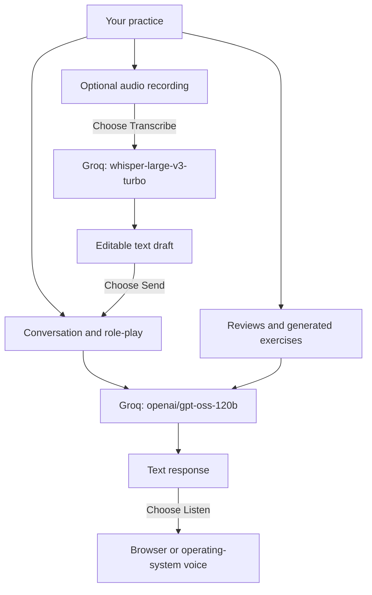

[ArguLab](../../README.md) / **AI task guide** · [Release notes](../releases/3.0.2.md)

# Which AI does what?

**Release: v3.0.2**

ArguLab uses **two distinct Groq-hosted model defaults** and the browser's speech service. Conversation and review tasks currently use the **same text model**, with different prompts, response formats and limits. The simulated moderator, interviewer and other participants are roles within those requests, not separately hosted AI models.

## The task-to-model map

| Task                                                                                                  | Model or service              | How the app uses it                                                                                         | Why this response format fits                                                                                                   |
| ----------------------------------------------------------------------------------------------------- | ----------------------------- | ----------------------------------------------------------------------------------------------------------- | ------------------------------------------------------------------------------------------------------------------------------- |
| Debate, interviews, public speaking, extempore practice, negotiation, cases and real-world simulation | Groq `openai/gpt-oss-120b`    | Streams the next conversational turn with the mode, topic, role, difficulty and language preferences        | Streaming lets the learner read while the answer arrives; scenario prompts keep the same model focused on the selected practice |
| Live group discussion                                                                                 | Groq `openai/gpt-oss-120b`    | Generates moderator and participant turns from the room context                                             | Different character instructions produce simulated viewpoints while sharing the conversation model                              |
| Session evaluation and Observer Mode analysis                                                         | Groq `openai/gpt-oss-120b`    | Returns a validated structured review: 15 score dimensions, strengths, weaknesses, fallacies and next steps | A defined JSON schema lets the app display, save and compare the review consistently                                            |
| Observer Mode sample discussion                                                                       | Groq `openai/gpt-oss-120b`    | Generates a discussion transcript and analysis questions                                                    | Structured turns and questions fit the observer exercise UI                                                                     |
| Group discussion wrap-up                                                                              | Groq `openai/gpt-oss-120b`    | Generates moderator feedback, a verdict and participant contribution summaries                              | Structured fields separate the closing summary from individual feedback                                                         |
| Thinking View                                                                                         | Groq `openai/gpt-oss-120b`    | Produces an educational interpretation of an exchange                                                       | A coaching schema explains observable techniques; it does not expose a model's hidden reasoning                                 |
| Extempore topic generation                                                                            | Groq `openai/gpt-oss-120b`    | Produces a short plain-text topic using the configured review model                                         | A brief text response is enough; the app keeps the first line                                                                   |
| Audio transcription                                                                                   | Groq `whisper-large-v3-turbo` | Converts an explicitly uploaded recording into text for the learner to edit                                 | This is a dedicated speech-to-text task; the transcript is never sent as an answer automatically                                |
| Read-aloud                                                                                            | Browser `speechSynthesis`     | Reads an AI reply using an available browser/OS voice                                                       | No separate backend text-to-speech API or Groq request is needed; voices and processing location depend on the device           |

These assignments describe the implementation, not a benchmark claiming one model is best for every task. There is **no automatic multi-provider selection or failover** in this release.

## Configuration, without exposing credentials

| Backend setting            | Shipped default          | Used by                                                                                     |
| -------------------------- | ------------------------ | ------------------------------------------------------------------------------------------- |
| `GROQ_CHAT_MODEL`          | `openai/gpt-oss-120b`    | Live session turns and the legacy debate endpoint                                           |
| `GROQ_STRUCTURED_MODEL`    | `openai/gpt-oss-120b`    | Reviews, generated discussions, wrap-ups, Thinking View **and plain-text extempore topics** |
| `GROQ_TRANSCRIPTION_MODEL` | `whisper-large-v3-turbo` | Audio transcription                                                                         |

Deployment environment variables can override these defaults. `GROQ_API_KEY` stays on the backend. Transcription can use `GROQ_TRANSCRIPTION_API_KEY`, falling back to the main Groq credential when absent. A separate key does not create a separate provider account quota. No API key belongs in a README, browser bundle or public repository.

## Request budgets and response limits

| Work                             | Application defaults                                                                                                  | Response controls                                                                                               |
| -------------------------------- | --------------------------------------------------------------------------------------------------------------------- | --------------------------------------------------------------------------------------------------------------- |
| Conversation and AI actions      | 60 requests per signed visitor/hour; 600 globally/hour; four concurrent responses per backend process                 | Conversation: up to 2,200 output tokens and a 60-second deadline                                                |
| Structured reviews and exercises | Share the conversation/AI request budget                                                                              | Up to 8,192 output tokens; 60-second overall deadline; one fresh generation for malformed/schema-invalid output |
| Extempore topic                  | Shares the conversation/AI request budget                                                                             | Up to 1,024 output tokens; 30-second deadline                                                                   |
| Transcription                    | 10 requests per visitor/hour, 20 per visitor/day, 100 globally/day and five globally/minute; two concurrent responses | Recording up to two minutes; audio up to 4 MB; 60-second provider deadline                                      |
| Read-aloud                       | No Groq request budget                                                                                                | User starts/stops playback; browser voice availability applies                                                  |

Provider quotas apply in addition to these limits. SDK retries and a structured-output retry can make more than one provider call for one application request. Visitor limits are device-based and global counters persist in PostgreSQL. The app does not promise unlimited free AI usage.

## What is not an AI call?

Local recording and playback, account authentication, saved history, exports, XP, streaks, badges and leaderboard totals do not need generative AI. Changing a review's scoring weights recalculates its existing scores; it does not request another model review or award another completion.

Audio stays in the tab until the learner chooses **Transcribe**. Text sent for a session or review is processed through the backend and Groq. Browser voices can process text remotely. Feedback evaluates submitted text, not pronunciation, vocal delivery or verified factual accuracy.

---

[Project history](../../PROJECT_HISTORY.md) · [Versioning](../../VERSIONING.md) · [Current release](../releases/3.0.2.md)
